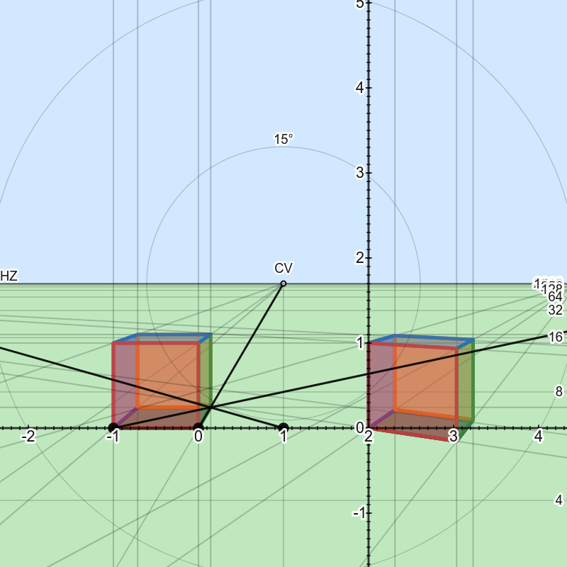

## Perspective drawing in desmos calculator
Did you ever wish there was a graphing calculator like desmos's but with 3D capabilities? 
Well, we don't know any either, but one can do projective geometry in desmos calculator:

[Perspective](https://www.desmos.com/calculator/gh7mq42f3h)

The URL of the link will change on new releases. Do not bookmark or save it.

